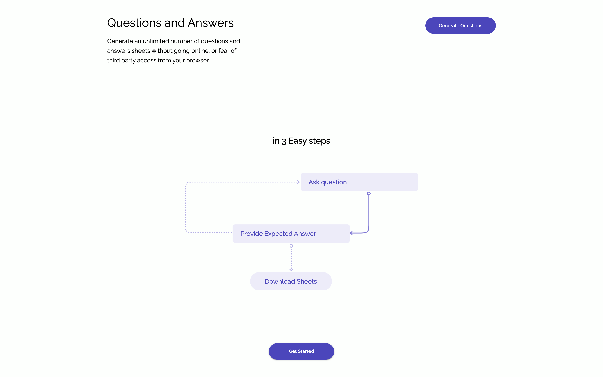
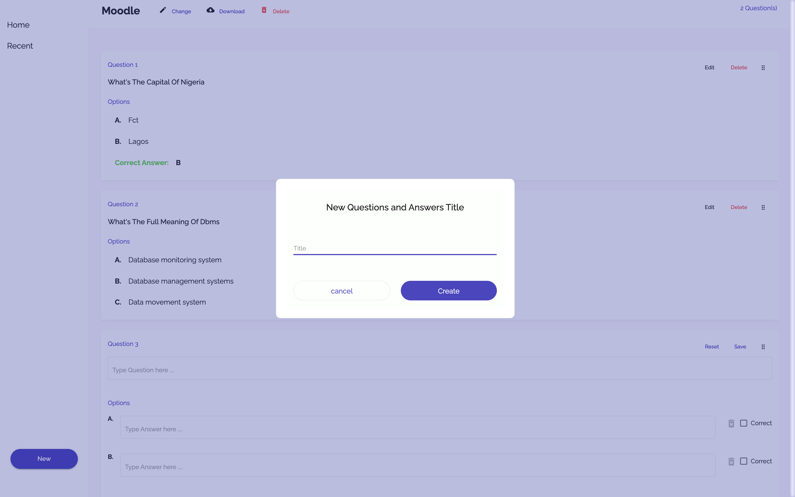

# Questions Generator

**[Moodle](https://moodle.org/)** is the world's most popular learning management system. Multichoice quiz is one of moodle’s features. Questions and answers are saved as text files (with a strict structure) in order to create a multichoice quiz with a huge number of questions. Directly creating such a large file requires maximum concentration from the instructors, since errors could become hard to detect (and might affect learners' grades).
But with Moodle question and answer generator, you can generate well-formatted moodle multichoice text files without understanding the Moodle standard through the application's beautiful and interactive interface.
You don’t have to complete the process at a stretch, all progress made is stored locally in the browsers’ IndexedDB database, you can close your laptop and continue later.
Getting started only requires you to visit **[Questions Generator](https://question-generator-84bc7.web.app)**
It was built using Angular and can be accessed subsequently without an internet connection.

## Setting up

Clone the project to your computer and run `npm install` **Ensure that NodeJs and npm are installed on your computer**

## Development server

Run `ng serve` for a dev server. Navigate to `http://localhost:4200/`. The app will automatically reload if you change any of the source files.

## Build

Run `ng build` to build the project. The build artifacts will be stored in the `dist/` directory. Use the `--prod` flag for a production build.

## Snapshots of the app in action

